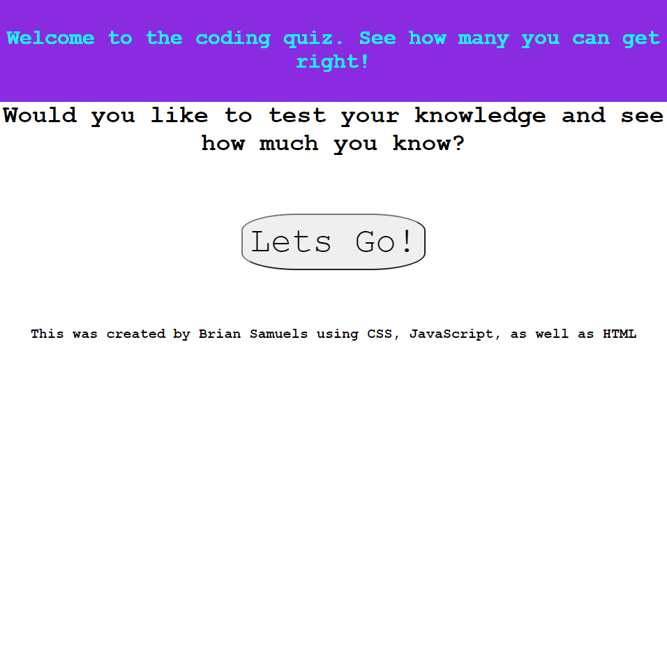

# Coding-Quiz
This is a fun coding quiz!

This quiz was made using JavaScript, HTML, as well as minimal CSS

link to deployed application: https://samuels1996.github.io/Coding-Quiz/
mock-up: 

During this assignment we were tasked with completing a quiz using JavaScript and using a timer to keep track of the time left to complete the quiz. 
On button click it will load in the question and answer elements. 

At the end of the quiz the user is then able to save their initials as well as their high score and then decide if they would like to play again